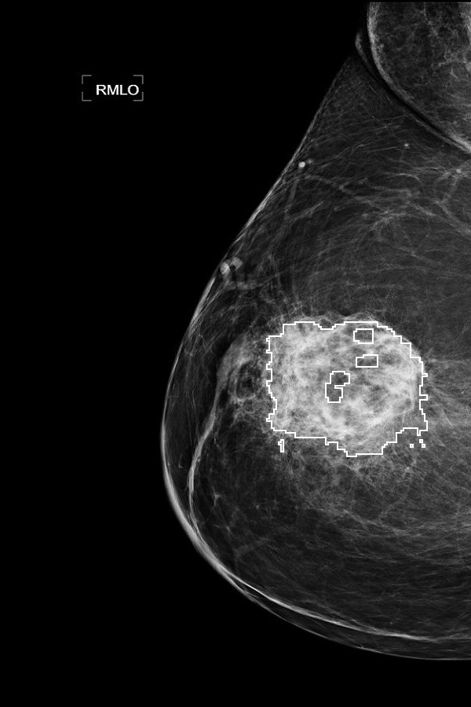

# Cancer-Detection-and-Segmentation-in-a-Mammogram
A Novel Approach for Breast Cancer Detection and Segmentation in a Mammogram


This repository contains the implementation of a simple and efficient approach for detecting and segmenting cancer regions in mammogram images. The methodology is based on the research article "A Novel Method for Cancer Detection and Segmentation in Mammogram Images."

## Table of Contents

- [Introduction](#introduction)
- [Methodology](#methodology)
- [Requirements](#requirements)
- [Usage](#usage)
- [Results](#results)
- [References](#references)
- [License](#license)

## Introduction

This project implements an algorithm for detecting and segmenting cancerous regions in mammogram images. The approach is simple and efficient, focusing on identifying dense, high-intensity regions likely to represent cancerous tissue. The algorithm uses techniques such as averaging filtering, thresholding, and a Max-Mean and Least-Variance technique to accurately detect and segment the cancerous region.

## Methodology

### Steps:
1. **Input Image Processing**:
    - A mammogram image is taken as input and an averaging filter is applied to smooth the image.

2. **Thresholding**:
    - A thresholding operation is performed to separate the cancerous region from the normal tissue.

3. **Max-Mean and Least-Variance Technique**:
    - A rectangular window is created around the detected region.
    - The window is divided into sub-windows, and the sub-windows with the highest mean intensity and least variance are identified as the cancerous region.

4. **Segmentation**:
    - Morphological closing and image gradient techniques are used to segment the cancerous region from the input image.

### Algorithm:
The detailed implementation of the Max-Mean and Least-Variance technique is provided in the [source code](#usage).

## Requirements

The following libraries are required to run the code:

- Python 3.x
- OpenCV
- NumPy
- SciPy
- scikit-image

Install the dependencies using pip:

```bash
pip install opencv-python numpy scipy scikit-image
```

## Usage

Clone the repository and run the main script to detect and segment cancerous regions in a mammogram image.

```bash
git clone https://github.com/anujsinghk/Cancer-Detection-and-Segmentation-in-a-Mammogram.git
cd Cancer-Detection-and-Segmentation-in-a-Mammogram
python detect_and_segment.py
```

### Input

Place your mammogram image in the root directory and update the image path in the script:

```python
image = cv2.imread('./input/mammogram.png', 0)
```

### Output

The output will display various stages of the image processing pipeline, including the detected and segmented cancerous region.

## Results

- The algorithm successfully detects and segments the cancerous region in the mammogram image.
- The segmented image highlights the most probable cancerous region with high accuracy.



## References

1. Singh, A. K., & Yadav, D. K. (2015). *A Novel Method for Cancer Detection and Segmentation in Mammogram Images*.
2. Dalmiya, M. et al., *A Comparative Method for Tumor Segmentation*.
